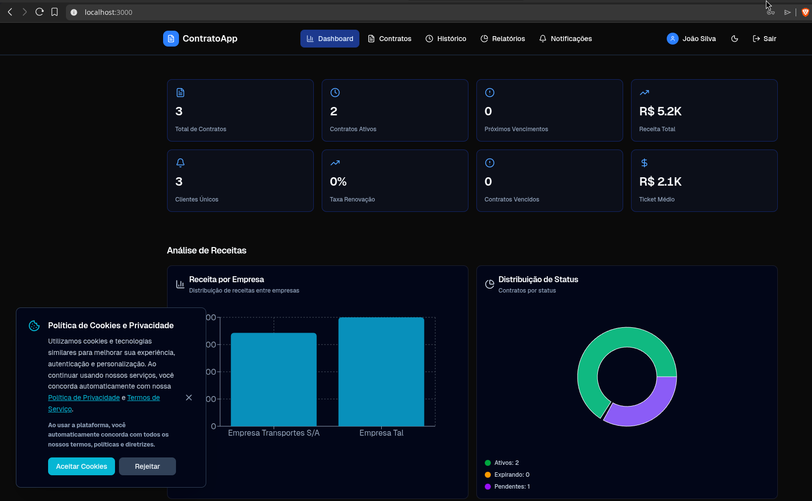

# Sistema de Gerenciamento de Contratos

Um sistema full-stack moderno e intuitivo para todos gerenciarem seus contratos de forma eficiente, com histórico completo, notificações automáticas de vencimento e relatórios detalhados.


## 🏗️ Arquitetura

```
container_contratos/
├── backend_contratos/        # API REST — Spring Boot 4 + Java 21
├── v0-sistema-de-contratos/  # Frontend — Next.js 16 + React 19
└── docker-compose.yml        # Orquestra os 3 serviços
```



### Fluxo geral

```
Browser (Next.js :3000)
        │  JWT via Authorization Header
        ▼
API REST (Spring Boot :8080)
        │  JPA / Hibernate
        ▼
PostgreSQL 18 (:5432)
```

---

## ✨ Funcionalidades

### 1. Dashboard
- Visão geral com estatísticas em tempo real
- Cards informativos: total de contratos, ativos, próximos vencimentos e expirando
- Valor total consolidado dos contratos
- Lista dos próximos vencimentos ordenados por urgência

### 2. Gerenciamento de Contratos (CRUD)
- **Criar:** Adicione novos contratos com dados completos
- **Visualizar:** Veja todos os detalhes do contrato
- **Editar:** Atualize informações quando necessário
- **Deletar:** Remova contratos com limpeza completa de histórico e notificações
- **Filtrar:** Busque por título, empresa, motorista ou status com paginação
- **Status automático:** Contratos marcados automaticamente como vencidos via job diário

### 3. Histórico com Versionagem por Diff
- Rastreie todas as alterações em cada contrato
- Registra **apenas os campos que mudaram** (diff, não snapshot completo)
- Versões incrementais numeradas
- Histórico global de todos os contratos
- Histórico individual por contrato

### 4. Notificações Inteligentes
- Alertas automáticos gerados **diariamente às 8h** para contratos vencendo
- Disparos nos marcos de **30, 15, 7 e 1 dia(s)** antes do vencimento
- Marque notificações como lidas individualmente ou todas de uma vez
- Filtrar por status de leitura
- Notificações de criação, atualização e exclusão de contratos

### 5. Relatórios Avançados
- Gráficos interativos (distribuição por status, valor por status, contratos por empresa)
- Resumo executivo com KPIs
- Exportação de relatórios em **PDF** e **Excel** diretamente no browser

### 6. Segurança
- Autenticação **JWT stateless** com BCrypt
- **Rate limiting por IP**: 15 req/min em `/auth`, 100 req/min na API geral (anti brute-force)
- Variáveis sensíveis via `.env`

### 7. UX
- **Tema claro/escuro**
- Layout responsivo (desktop e mobile)
- API documentada com **Swagger / OpenAPI**

---

## 🛣️ Rotas do Frontend

| Rota | Descrição |
|---|---|
| `/` | Dashboard principal |
| `/login` | Autenticação |
| `/register` | Cadastro |
| `/contratos` | Lista de contratos |
| `/contratos/novo` | Criar novo contrato |
| `/contratos/[id]` | Detalhes do contrato |
| `/contratos/[id]/editar` | Editar contrato |
| `/contratos/[id]/historico` | Histórico do contrato |
| `/historico` | Histórico global |
| `/notificacoes` | Central de notificações |
| `/relatorios` | Relatórios e análises |

---

## 🔧 Stack

### Backend
| Tecnologia | Versão | Uso |
|---|---|---|
| Java | 21 | Linguagem |
| Spring Boot | 4.0.6 | Framework principal |
| Spring Security | — | Autenticação e autorização |
| Spring Data JPA | — | Persistência |
| Spring Scheduling | — | Job de notificações diárias |
| PostgreSQL | 18 | Banco de dados |
| JJWT | 0.12.6 | Geração e validação de JWT |
| Bucket4j | 8.10.1 | Rate limiting por IP |
| SpringDoc OpenAPI | 2.8.8 | Documentação Swagger UI |
| Lombok | — | Redução de boilerplate |
| JUnit 5 + H2 | — | Testes unitários e de integração |
| Gradle | — | Build tool |

### Frontend
| Tecnologia | Versão | Uso |
|---|---|---|
| Next.js | 16 | Framework React (App Router) |
| React | 19 | UI |
| TypeScript | 5.7 | Tipagem estática |
| Tailwind CSS | 4 | Estilização |
| Radix UI / shadcn/ui | — | Componentes acessíveis |
| React Hook Form + Zod | — | Formulários e validação |
| Recharts | 2.15 | Gráficos do dashboard |
| jsPDF + ExcelJS | — | Exportação de relatórios |
| next-themes | — | Tema claro/escuro |
| Lucide React | — | Ícones |

### Infraestrutura
| Tecnologia | Uso |
|---|---|
| Docker + Docker Compose | Orquestração dos 3 serviços |
| PostgreSQL 18 Alpine | Banco de dados containerizado |
| Health checks | Garante ordem de inicialização dos serviços |

---

## 🚀 Como rodar

### Pré-requisitos
- [Docker](https://www.docker.com/) e Docker Compose instalados

### 1. Clone o repositório
```bash
git clone https://github.com/SEU_USUARIO/NOME_DO_REPO.git
cd container_contratos
```

### 2. Configure as variáveis de ambiente
```bash
cp backend_contratos/.env.example backend_contratos/.env
cp v0-sistema-de-contratos/.env.example v0-sistema-de-contratos/.env.local
```

Edite `backend_contratos/.env` com suas configurações:
```env
POSTGRES_DB=backend_contratos
POSTGRES_USER=postgres
POSTGRES_PASSWORD=sua_senha_segura

DB_URL=jdbc:postgresql://postgres:5432/backend_contratos
DB_USERNAME=postgres
DB_PASSWORD=sua_senha_segura

# Gere com: openssl rand -base64 32
JWT_SECRET=sua_chave_base64_aqui
```

### 3. Suba todos os serviços
```bash
docker compose up -d --build
```

| Serviço | URL |
|---|---|
| Frontend | http://localhost:3000 |
| Backend API | http://localhost:8080 |
| Swagger UI | http://localhost:8080/swagger-ui.html |

### Comandos úteis
```bash
# Ver logs em tempo real
docker compose logs -f

# Parar tudo
docker compose down

# Parar e apagar dados do banco
docker compose down -v

# Rebuild de um serviço específico
docker compose up -d --build app
```

---

## 📋 Endpoints da API

### Autenticação (`/auth`)
| Método | Rota | Descrição |
|---|---|---|
| POST | `/auth/login` | Login — retorna JWT |
| POST | `/auth/register` | Cadastro de novo usuário |

### Contratos (`/contratos`)
| Método | Rota | Descrição |
|---|---|---|
| GET | `/contratos` | Lista paginada |
| GET | `/contratos/{id}` | Busca por ID |
| GET | `/contratos/{id}/historico` | Histórico de alterações |
| GET | `/contratos/dashboard` | Estatísticas do dashboard |
| POST | `/contratos` | Cria contrato |
| PUT | `/contratos/{id}` | Atualiza contrato |
| DELETE | `/contratos/{id}` | Remove contrato |

### Notificações (`/notificacoes`)
| Método | Rota | Descrição |
|---|---|---|
| GET | `/notificacoes` | Lista todas |
| GET | `/notificacoes/nao-lidas` | Lista não lidas |
| PATCH | `/notificacoes/{id}/lida` | Marca como lida |
| PATCH | `/notificacoes/{id}/nao-lida` | Marca como não lida |
| PATCH | `/notificacoes/marcar-todas-lidas` | Marca todas como lidas |

> Documentação interativa completa: **http://localhost:8080/swagger-ui.html**

---

## 📁 Estrutura do Backend

```
src/main/java/com/malloc/backend_contratos/
├── BackendContratosApplication.java
├── controller/          # Camada HTTP (REST)
│   ├── AuthController
│   ├── ContratoController
│   └── NotificacaoController
├── business/            # Regras de negócio
│   ├── ContratoService
│   ├── NotificacaoService
│   ├── UsuarioService
│   ├── converter/       # Entity ↔ DTO
│   └── dto/             # Objetos de transferência
└── infrastructure/      # Detalhes técnicos
    ├── config/          # EnvLoader, properties
    ├── entity/          # Entidades JPA
    ├── exceptions/      # GlobalExceptionHandler
    ├── repository/      # Spring Data JPA
    └── security/        # JWT, Rate Limiting, CORS
```

---

## 🧪 Testes

```bash
cd backend_contratos
./gradlew test
```

Os testes usam banco H2 em memória — não requerem PostgreSQL rodando.

---

## 📄 Licença

Este projeto está sob a licença MIT. Veja o arquivo [LICENSE](LICENSE) para mais detalhes.

